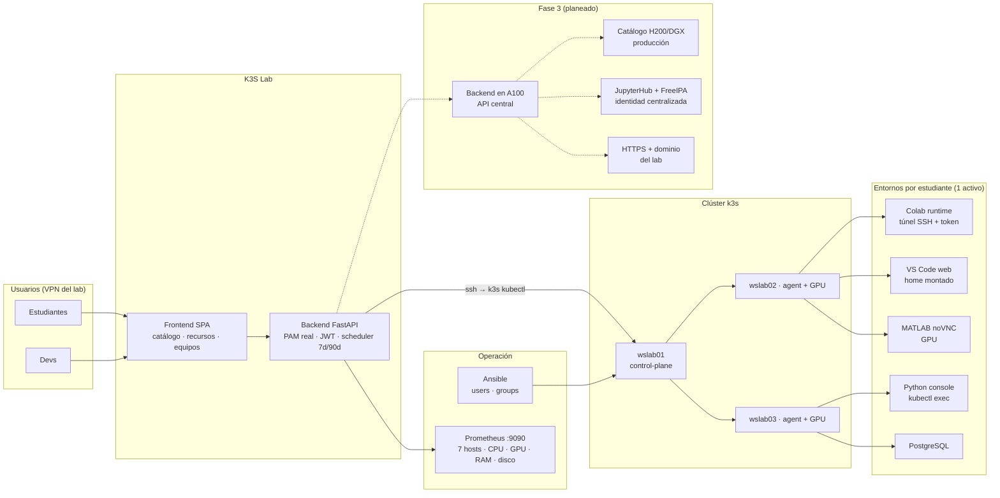

# K3S Lab

Plataforma académica tipo *Lightning Studio* sobre un clúster **k3s** de la USFQ: catálogo de entornos por estudiante con **GPU bajo demanda**, homes persistentes de los laboratorios y ciclo de vida automático (7 días inactivo → detenido · 90 días → eliminado).

## ¿Qué hace?

- **Catálogo de entornos**: Colab runtime (connect-to-local-runtime), VS Code web, MATLAB (noVNC), Python console y PostgreSQL — cada estudiante lanza su entorno desde el panel con **1 entorno activo**.
- **GPU como recurso**: cualquier tipo de entorno puede pedir GPU (todas o por índice) vía `runtimeClassName: nvidia` + `NVIDIA_VISIBLE_DEVICES`.
- **Homes persistentes**: los pods montan el `/home/<usuario>` del nodo del laboratorio, así los archivos sobreviven al entorno.
- **PAM real**: el login del panel valida contra las cuentas Linux de los servidores (ssh/paramiko) — una sola contraseña gobierna todo, sin contraseñas semilla.
- **Panel de dev**: monitoreo de los 7 hosts (CPU, GPU modelo/VRAM, RAM, disco, contenedores, kernel) vía Prometheus, y gestión de entornos de estudiantes (detener/eliminar).
- **Ansible**: playbooks para grupos (`students`/`devs`) y alta de usuarios con contraseña unificada en los 3 nodos.

## Arquitectura (estado final planeado)

## Stack

| Capa | Tecnología |
|---|---|
| Clúster | k3s (control-plane + 2 agents GPU: A4000 ×2, RTX A2000) |
| Backend | Python · FastAPI · SQLite · paramiko (PAM) · APScheduler |
| Frontend | SPA estática servida por FastAPI |
| Manifiestos | Generados dinámicamente por tipo/nodo/GPU/mount |
| Operación | Ansible · Prometheus (node/dcgm/cadvisor) |
| Entornos | Colab runtime · code-server · MATLAB r2024a · python-slim · postgres |

## Estado

**MVP validado**: ciclo de vida de entornos, flujo Colab completo (túnel + token), VS Code web con uid/gid del owner, MATLAB con GPU en noVNC, PAM real, panel de equipos y gestión admin.
